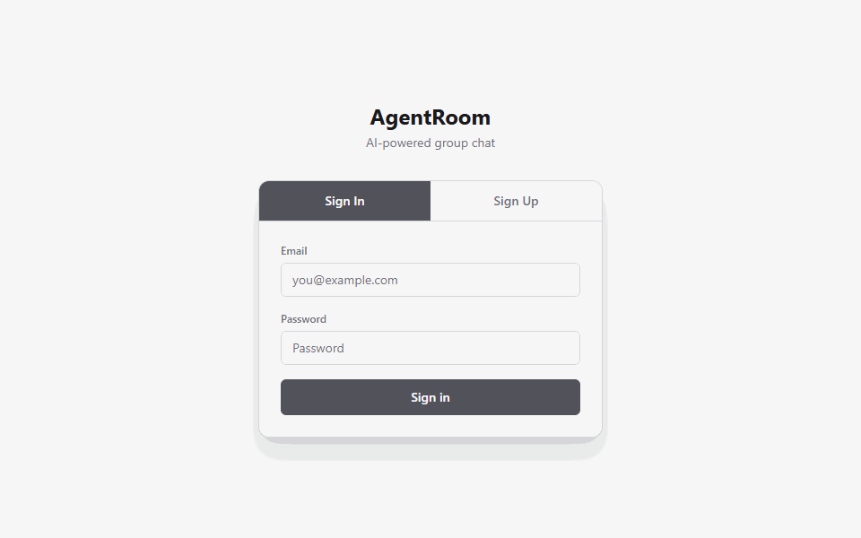

# AgentRoom

AgentRoom is a WhatsApp/Slack-style group chat for local LLM agents. A human can create a room, add named agents, send a message, and watch each active agent respond as a visible participant in the same conversation.

The project is built as a pnpm monorepo with a Next.js web app, a Supabase-backed data layer, and a separate TypeScript bridge daemon that executes local agent CLIs such as Claude Code and Codex CLI.

## Demo



## Features

- Group chat UI with named AI participants
- Supabase Auth, Postgres, Storage, and Realtime
- Queue-based agent execution through the `agent_runs` table
- Bridge daemon for subprocess-based agent adapters
- Claude Code, Codex CLI, Ruflo, custom Claude, and mock adapter support
- Mentions with `@agent_slug` and `@everyone`
- `/discuss` mode for multi-agent deliberation before a final answer
- Agent-to-agent tag turns with loop guards
- File attachments, pasted screenshots, signed download links, and image text extraction support
- Message pinning and unpinning
- Tool approval flow for protected actions
- Run cancellation for stuck or unwanted agent responses
- Markdown and math rendering for agent replies
- Hallucination flagging and rejection workflow

## Repository Layout

```text
.
+-- apps/
|   +-- web/                  # Next.js App Router app and API route handlers
+-- bridge/                   # TypeScript bridge daemon and agent adapters
+-- packages/
|   +-- shared/               # Shared TypeScript types and discussion helpers
+-- scripts/                  # Local automation and stress-test scripts
+-- supabase/                 # Supabase config, migrations, and seed data
+-- QUICKSTART.md             # Short local startup guide
+-- start-agentroom.bat       # Windows launcher for local development
+-- package.json              # Root workspace scripts
```

Generated files such as logs, `.next`, `node_modules`, local Claude task folders, desktop shortcuts, and temporary bridge test folders are ignored so the repository stays focused on source code and project documentation.

## Architecture

```text
Browser
  |
  | Next.js route handlers
  v
Supabase
  |  rooms, messages, files, pinned_items
  |  agent_runs is the work queue
  v
Bridge daemon
  |  claims queued runs
  |  builds ContextPacketV1
  |  invokes local agent adapters
  v
Local agent CLIs
  Claude Code, Codex CLI, Ruflo, mock agents
```

The browser never writes directly to `agent_runs`. User actions go through the Next.js API, which writes database rows. The bridge polls Supabase, claims queued runs, invokes the correct adapter, saves the final agent message, and marks the run completed, failed, or cancelled.

## Prerequisites

- Node.js 22.13+ (see `.nvmrc`)
- pnpm 11+ (`npm install -g pnpm@11.0.8` or `corepack enable`)
- Docker Desktop
- Supabase CLI
- Claude CLI, if using Claude agents
- Codex CLI, if using Codex agents
- Ruflo CLI, if using Ruflo agents

> **One-command local setup** (macOS / Linux / WSL): `make bootstrap`.
> **Docker / containers / self-hosting:** see [`docs/SELF_HOSTING.md`](docs/SELF_HOSTING.md).

## Environment Setup

Copy the example env files:

```powershell
Copy-Item apps/web/.env.example apps/web/.env.local
Copy-Item bridge/.env.example bridge/.env
```

Web env:

```env
NEXT_PUBLIC_SUPABASE_URL=
NEXT_PUBLIC_SUPABASE_PUBLISHABLE_KEY=
SUPABASE_SERVICE_ROLE_KEY=
NEXT_PUBLIC_APP_URL=http://localhost:3000
```

Bridge env:

```env
SUPABASE_URL=
SUPABASE_SERVICE_ROLE_KEY=
BRIDGE_WORKER_ID=bridge-local-1
BRIDGE_POLL_INTERVAL_MS=2000
BRIDGE_MAX_CONCURRENT_RUNS=3
BRIDGE_HEARTBEAT_INTERVAL_MS=5000
BRIDGE_STALE_RUN_TIMEOUT_MS=60000
CLAUDE_BIN=claude
CODEX_BIN=codex
MYCLAUDE_BIN=myclaude
RUFLO_BIN=ruflo
OPENAI_API_KEY=
OPENAI_VISION_MODEL=gpt-4.1-mini
```

Keep real keys out of git. The project uses `NEXT_PUBLIC_SUPABASE_PUBLISHABLE_KEY`; do not rename it to the deprecated anon key variable.

## Install

```powershell
pnpm install
```

## Database

Start Supabase locally:

```powershell
pnpm dev:supabase
```

Apply migrations and seed data:

```powershell
pnpm db:reset
```

Supabase Studio is usually available at:

```text
http://127.0.0.1:54323
```

## Run Locally

Start the web app:

```powershell
pnpm dev:web
```

Start the bridge daemon in a second terminal:

```powershell
pnpm dev:bridge
```

Open:

```text
http://localhost:3000/auth
```

On Windows, you can also use:

```powershell
.\start-agentroom.bat
```

That launcher checks Docker, starts Supabase, creates missing env files from `supabase status` when possible, starts the web app and bridge, and opens the browser.

## Common Commands

```powershell
pnpm typecheck          # Type-check all workspaces
pnpm test               # Run web and bridge tests
pnpm lint               # Run lint/type lint checks
pnpm --filter web build # Build the Next.js app
pnpm stress:agents      # Run the multi-agent stress test script
```

## Chat Commands

Mention a single agent:

```text
@codex_builder respond to this
```

Mention all eligible agents:

```text
@everyone compare these approaches
```

Start a structured team discussion:

```text
/discuss Solve this integral: integral from 0 to pi/2 of dx / (1 + tan x)^2
```

In discussion mode, agents first contribute independently, then critique and synthesize, then produce a final consensus answer. Agent replies only create follow-up runs when tag-turn mode allows it and the reply explicitly mentions another eligible agent.

## Testing Agent Behavior

The bridge test suite covers:

- Mention parsing
- Agent-to-agent follow-up scheduling
- Deliberation depth and loop guards
- Discussion phase orchestration
- Adapter prompt construction
- File context injection
- Stale run recovery
- Hallucination checks

The web test suite covers:

- API validation and auth behavior
- Room and agent management
- Message formatting
- Pasted files
- Pinning
- Theme selection
- Run cancellation
- Discussion command parsing

## Troubleshooting

If the browser shows a blank page after a build, clear the Next dev cache and restart the web server:

```powershell
Remove-Item apps/web/.next -Recurse -Force
pnpm dev:web
```

If an agent run stays in `running`, use the UI stop button or restart the bridge. Stale run recovery will mark old claimed/running rows as failed.

If screenshot questions are not understood, check that:

- The file is attached to the message
- `OPENAI_API_KEY` is valid when automatic image extraction is needed
- The bridge has restarted after env changes

If a tagged agent does not respond, check that the agent is:

- Active
- A member of the room
- Not muted
- `reply_enabled = true`
- Mentioned by slug or supported display name

## Project Status

The MVP is complete. Current work focuses on hardening the local developer experience, improving multi-agent deliberation quality, and making output rendering stable for real math and code-heavy answers.
