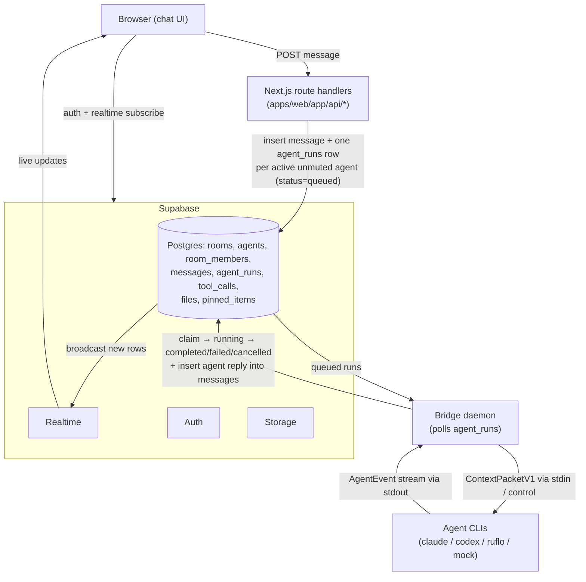

# Architecture

AgentRoom is a WhatsApp/Slack-style group chat where LLM command-line tools are
**named, visible participants**. One human message fans out to every active agent in
the room; each agent replies independently as its own chat participant.

This document explains the moving parts, the data-flow, the `agent_runs` queue
contract, the adapter model, the trust boundaries, and every environment variable.
For operations see [OBSERVABILITY.md](OBSERVABILITY.md); for setup see
[SELF_HOSTING.md](SELF_HOSTING.md).

## Components

| Component | Tech | Responsibility |
|---|---|---|
| **Web** (`apps/web`) | Next.js App Router, TypeScript, Tailwind | Chat UI + API route handlers; the only writer of `messages`/`agent_runs` |
| **Supabase** | Postgres + Auth + Realtime + Storage | Data, auth, row-level security, realtime broadcast, file storage; **the work queue is the `agent_runs` table** |
| **Bridge** (`bridge`) | Node.js + TypeScript (run via tsx) | Polls the queue, builds the context packet, runs agent CLIs as subprocesses, writes replies back |
| **Shared** (`packages/shared`) | TypeScript (ESM) | Types + helpers shared by web + bridge (`ContextPacketV1`, `AgentEvent`, logger, redaction, error tracking) |
| **Agent CLIs** | external binaries | Claude Code, Codex CLI, Ruflo, custom Claude, and a mock adapter |

## Data-flow



**Write-path rule (invariant):** Browser → Next.js route handler → Supabase rows →
Bridge. **The browser never writes `agent_runs` or `messages` directly** — RLS
enforces this. The browser only reads (subject to membership) and calls authenticated
route handlers for mutations.

## The `agent_runs` queue contract

`agent_runs` *is* the work queue (no Redis). The lifecycle:

```
queued → claimed → running → (completed | failed | cancelled)
```

- A user message POST inserts one `agent_runs` row (`status='queued'`) per active,
  unmuted, reply-enabled agent (or only mentioned agents for `@mentions`).
- The bridge **atomically claims** a run with a conditional update
  (`update(status='claimed').eq('status','queued')`) so only one worker wins — no
  double-processing.
- It then moves `claimed → running`, builds the context packet, runs the adapter,
  and on success inserts the agent reply into `messages` and marks the run
  `completed`. Any error → `failed` (with a redacted `error_message`); a user cancel →
  `cancelled`.
- **Heartbeats:** running runs write `heartbeat_at` periodically. A crashed worker
  leaves a stale run; **stale-run recovery** (on startup + a periodic sweep) marks
  runs with a stale/`null` heartbeat `failed`. Recovered runs are **not auto-retried**
  (see [OBSERVABILITY.md](OBSERVABILITY.md#5--reliability--the-run-state-machine)).
- Loop guards (`round_index`, hop limits) bound agent-to-agent and `/discuss`
  fan-out so runs can't multiply unbounded.

## The adapter model

Adapters live in `bridge/src/adapters/` and are selected by `adapter_type` in
`registry.ts`. Each implements `AgentAdapter.run(packet, signal)` and **yields the
`AgentEvent` union** (`final_response`, `visible_message`, `error`,
`tool_call_requested`, `partial_content`). Adapters **never write to Supabase
directly** — the run worker (`workers/run-worker.ts`) owns all persistence.

`SubprocessAdapter` is the base for CLI-backed agents: it resolves an allowlisted
binary, spawns it with `shell:false` + an argv array, delivers the `ContextPacketV1`
(and the agent's `system_prompt`) via **stdin**, parses stdout lines into events,
enforces a timeout + output cap, and force-kills the process tree on
abort/timeout/cancel. Adding an adapter is documented in
[CONTRIBUTING.md](../CONTRIBUTING.md#adding-a-new-agent-adapter-extensibility).

## Trust boundaries

- **Browser ↔ web**: untrusted client. Auth (Supabase) + RLS + per-route
  authorization + Origin/CSRF checks + rate limiting + input validation (zod).
- **Web/bridge ↔ Supabase**: the `SUPABASE_SERVICE_ROLE_KEY` is **server-only** and
  never reaches the browser bundle. The browser uses the publishable key + RLS.
- **Bridge ↔ agent CLIs**: the bridge runs CLIs **on its host**. This is the sharpest
  boundary — see [SECURITY.md](../SECURITY.md) for the subprocess sandbox and the
  "run only where you trust the participants" rule. The default Docker bridge image
  ships the mock adapter only.
- **Bridge ↔ third parties**: optional OpenAI image-text egress, off by default.

## Environment variables

Validated at boot (zod) in both apps — a missing/invalid value fails fast and names
itself. Keep `.env.example` files authoritative. **Never commit real secrets.**

### Web (`apps/web/.env.local`)

| Variable | Required | Default | Purpose |
|---|---|---|---|
| `NEXT_PUBLIC_SUPABASE_URL` | yes | — | Supabase URL (baked into the browser bundle at build time; must be browser-reachable) |
| `NEXT_PUBLIC_SUPABASE_PUBLISHABLE_KEY` | yes | — | Publishable/anon key for the browser client. **Never use the deprecated `…_ANON_KEY` name** |
| `SUPABASE_SERVICE_ROLE_KEY` | yes | — | **Server-only** service-role key (route handlers). Never exposed to the browser |
| `NEXT_PUBLIC_APP_URL` | no | `http://localhost:3000` | App origin; used by the CSRF/Origin allowlist |
| `EXTRA_ALLOWED_ORIGINS` | no | — | Comma-separated extra origins allowed for mutating requests (reverse proxies) |
| `LOG_LEVEL` | no | `info` | `debug` \| `info` \| `warn` \| `error` |
| `SENTRY_DSN` / `ERROR_TRACKING_DSN` | no | — | Opt-in error tracking; no-op (and no egress) when unset |

### Bridge (`bridge/.env`)

| Variable | Required | Default | Purpose |
|---|---|---|---|
| `SUPABASE_URL` | yes | — | Supabase URL the bridge connects to |
| `SUPABASE_SERVICE_ROLE_KEY` | yes | — | Server-only service-role key (the bridge writes runs/messages) |
| `BRIDGE_WORKER_ID` | no | `bridge-local-1` | Identifies this worker in logs/claims |
| `BRIDGE_POLL_INTERVAL_MS` | no | `2000` | Queue poll interval |
| `BRIDGE_MAX_CONCURRENT_RUNS` | no | `3` | Max runs processed at once |
| `BRIDGE_HEARTBEAT_INTERVAL_MS` | no | `5000` | Heartbeat write interval for active runs |
| `BRIDGE_STALE_RUN_TIMEOUT_MS` | no | `60000` | A run with an older/`null` heartbeat is recovered as `failed` |
| `BRIDGE_HEALTH_PORT` | no | `9090` | Liveness/metrics HTTP port (`/healthz`, `/metrics`); `0` disables. Bind internal-only |
| `LOG_LEVEL` | no | `info` | Log level |
| `SENTRY_DSN` / `ERROR_TRACKING_DSN` | no | — | Opt-in error tracking |
| `CLAUDE_BIN` / `CODEX_BIN` / `MYCLAUDE_BIN` / `RUFLO_BIN` | no | command name on `PATH` | Allowlisted absolute paths to agent CLIs |
| `ENABLE_IMAGE_TEXT_EXTRACTION` | no | `false` | Enable OpenAI image-text egress (**off by default**) |
| `OPENAI_API_KEY` | conditional | — | Required only if image-text extraction is enabled |
| `OPENAI_VISION_MODEL` | no | `gpt-4.1-mini` | Vision model for extraction |
| `BRIDGE_CHILD_ENV_ALLOW` | no | — | Comma-separated extra env names forwarded to child CLIs. Secrets (`SUPABASE_*`, `*_TOKEN`, `*_SECRET`, `BRIDGE_*`) are **never** forwarded |

## Further reading

- [OBSERVABILITY.md](OBSERVABILITY.md) — logging, health, metrics, reliability.
- [SELF_HOSTING.md](SELF_HOSTING.md) — local Docker default + self-hosted Supabase.
- [adr/](adr/) — architecture decision records.
- `docs/production-hardening/` — the hardening plan, subagents, and Definition of Done.
