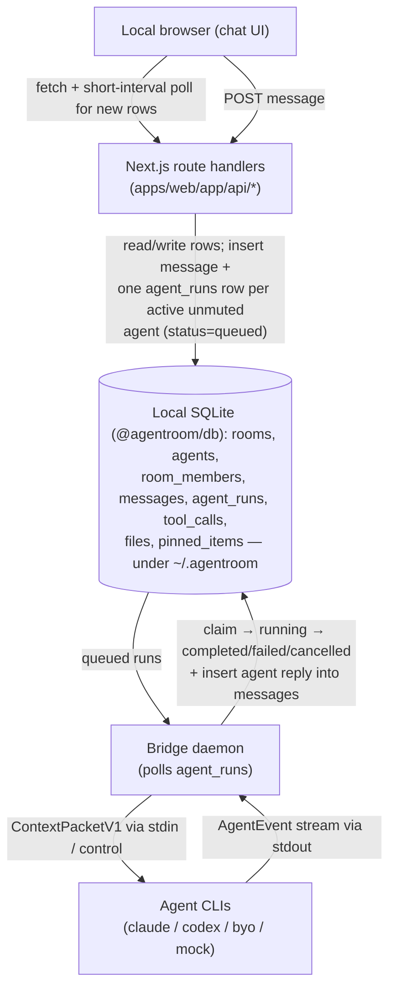

# Architecture

> **Heads up — local-only.** AgentRoom is a **local, single-user** app: state lives in a
> local SQLite database + files folder (`@agentroom/db`, under `~/.agentroom`), there is
> **no Supabase, no Docker, and no login**, and "realtime" is short-interval polling of
> the Next.js API. The component shapes (chat UI → API → `agent_runs` queue → bridge →
> CLIs) are unchanged. For connecting CLIs see
> [CONNECTING_CLIS.md](CONNECTING_CLIS.md); for the quickstart see the [README](../README.md).

AgentRoom is a WhatsApp/Slack-style group chat where LLM command-line tools are
**named, visible participants**. One human message fans out to every active agent in
the room; each agent replies independently as its own chat participant.

This document explains the moving parts, the data-flow, the `agent_runs` queue
contract, the adapter model, the trust boundaries, and every environment variable.
For operations see [OBSERVABILITY.md](OBSERVABILITY.md); for setup see
[SELF_HOSTING.md](SELF_HOSTING.md).

## Components

| Component | Tech | Responsibility |
|---|---|---|
| **Web** (`apps/web`) | Next.js App Router, TypeScript, Tailwind | Chat UI + API route handlers; the only writer of `messages`/`agent_runs` |
| **DB** (`packages/db`) | local SQLite (better-sqlite3) | Data + file metadata + the `config.json` of connected CLIs, all under `~/.agentroom`; **the work queue is the `agent_runs` table** |
| **Bridge** (`bridge`) | Node.js + TypeScript (run via tsx) | Polls the queue, builds the context packet, runs agent CLIs as subprocesses, writes replies back |
| **Shared** (`packages/shared`) | TypeScript (ESM) | Types + helpers shared by web + bridge (`ContextPacketV1`, `AgentEvent`, logger, redaction, error tracking) |
| **Agent CLIs** | external binaries | Claude Code, Codex CLI, any bring-your-own CLI, and a mock adapter |

## Data-flow



**Write-path rule (invariant):** Browser → Next.js route handler → local SQLite
(`@agentroom/db`) → Bridge. **The browser never writes `agent_runs` or `messages`
directly** — it has no database access at all and only talks to the route handlers,
which own every write.

## The `agent_runs` queue contract

`agent_runs` *is* the work queue (no Redis). The lifecycle:

```
queued → claimed → running → (completed | failed | cancelled)
```

- A user message POST inserts one `agent_runs` row (`status='queued'`) per active,
  unmuted, reply-enabled agent (or only mentioned agents for `@mentions`).
- The bridge **atomically claims** a run with a conditional SQL update
  (`UPDATE agent_runs SET status='claimed' … WHERE id=? AND status='queued'`) so only
  one worker wins — no double-processing.
- It then moves `claimed → running`, builds the context packet, runs the adapter,
  and on success inserts the agent reply into `messages` and marks the run
  `completed`. Any error → `failed` (with a redacted `error_message`); a user cancel →
  `cancelled`.
- **Heartbeats:** running runs write `heartbeat_at` periodically. A crashed worker
  leaves a stale run; **stale-run recovery** (on startup + a periodic sweep) marks
  runs with a stale/`null` heartbeat `failed`. Recovered runs are **not auto-retried**
  (see [OBSERVABILITY.md](OBSERVABILITY.md#5--reliability--the-run-state-machine)).
- Loop guards (`round_index`, hop limits) bound agent-to-agent and `/discuss`
  fan-out so runs can't multiply unbounded — see
  [Agent-to-agent interaction](#agent-to-agent-interaction-phase-10).

## The adapter model

Adapters live in `bridge/src/adapters/` and are selected by `adapter_type` in
`registry.ts`. Each implements `AgentAdapter.run(packet, signal)` and **yields the
`AgentEvent` union** (`final_response`, `visible_message`, `error`,
`tool_call_requested`, `partial_content`, `memory_op` (Phase 9), and
`handoff_requested` (Phase 10)). Adapters **never write to the database
directly** — the run worker (`workers/run-worker.ts`) owns all persistence.

`SubprocessAdapter` is the base for CLI-backed agents: it resolves an allowlisted
binary, spawns it with `shell:false` + an argv array, delivers the `ContextPacketV1`
(and the agent's `system_prompt`) via **stdin**, parses stdout lines into events,
enforces a timeout + output cap, and force-kills the process tree on
abort/timeout/cancel. Adding an adapter is documented in
[CONTRIBUTING.md](../CONTRIBUTING.md#adding-a-new-agent-adapter-extensibility).

## Agent-to-agent interaction (Phase 10)

Agents are first-class peers: each run's `ContextPacketV1.roster` lists the **other**
active room agents (`name`, `slug`, and a `capabilities` blurb), rendered as
reference DATA so an agent can address a peer deliberately — by `@mention` or by a
hand-off. The roster excludes the acting agent and muted/inactive members.

**Hand-off protocol (agent-emitted).** An agent emits a `handoff_requested` event by
printing a control envelope to stdout (`{ "type":"handoff_requested", "to_agent_slug",
"reason", "payload"? }`); the subprocess adapter parses it into the `AgentEvent`
(alongside `final_response`/`memory_op`). The run worker defers it until the agent's
reply is inserted (that message becomes the peer run's trigger), then
`agents/handoff.ts` resolves the slug to a room agent and creates a **targeted**
`agent_runs` row — never the agent itself — under the full loop guards **and cycle
detection** below. At most `MAX_HANDOFFS_PER_RUN` are honored per run.

**User `/handoff` (a convenience, not the agent engine).** `/handoff @agent <task>`
typed by a user is rewritten client-side to a targeted `@agent <task>` message and
goes through the normal messages route + mention routing. It is **round/hop bounded**
like any mention but does **not** run the agent-chain cycle detection (a human turn
is not a loop risk; the deliberation chain it may start is still round-capped).
`/agents` lists the roster + active runs.

**Loop-guard math (agent hand-off chains provably terminate).** An agent-emitted
hand-off is allowed only when **all** hold; otherwise it's blocked (and a cap/cycle
posts a visible *"Deliberation ended …"* system message):

- `rooms.allow_agent_to_agent` is true.
- **Round cap:** `round_index + 1 < rooms.max_agent_rounds` (default 3).
- **Hop cap:** `deliberation_depth + 1 ≤ rooms.max_agent_hops` (default 6).
- **No cycle:** the target has **not** already appeared in this hand-off chain. Every
  run in a chain shares a `deliberation_root_id`; cycle detection collects the root
  run's agent plus all descendants and rejects a hand-off to any agent already
  present (so `A→B→A`, `A→B→C→B`, etc. are stopped).

Because `deliberation_depth` strictly increases per hand-off and is bounded by
`max_agent_hops` — and a repeat participant is rejected — every chain terminates.
The `/discuss` phase machine (`individual → critique → consensus`) and the
`tag_turns` mention-follow-up path are bounded the same way by `max_agent_rounds`.

## Slash commands & RBAC (Phase 11)

A single **command registry** (`packages/shared/src/commands.ts`,
`COMMAND_REGISTRY`) is the source of truth for every in-product slash command:
`{ name, description, argsSpec, minRole, surface }`. Both the message parser
(`apps/web/lib/slash-commands.ts`, via `extractCommand`) and the API read from it,
so a command's existence and role gating live in one place. The v1 set:
`/help`, `/commands`, `/discuss`, `/remember`, `/recall`, `/handoff`, `/agents`,
`/pin`, `/reset`.

**RBAC.** Roles are the per-room `MemberRole` (`owner > admin > member`). `roleAllows`
ranks them; `allowedCommands`/`formatHelp` drive `/help`, which lists **exactly** the
caller's permitted commands. Member-level commands need only room membership;
admin-only commands (currently `/reset`) are enforced **server-side** — the
`/reset` route calls `requireRoomAdmin`, so a `member` is rejected with 403 even if the
UI did not hide the command. The parser never bypasses the role check or the
tool-approval flow; unknown/over-privileged commands get a friendly rejection rather
than being sent.

**`/reset`** clears a room's *rolling agent context* without deleting data: it stamps
`rooms.context_reset_at`, and the bridge context builder only includes messages created
at/after that watermark. The transcript stays intact and the action is reversible.

## User-created agents (Phase 11)

Beyond adding seeded agents to a room, admins can author new agents:
`POST /api/agents` (create + attach to a room), `PATCH/DELETE /api/agents/[agentId]`
(edit / disable). **RBAC:** create requires `requireRoomAdmin` on the target room;
edit/disable require being the agent's creator (`created_by_user_id` = the local user).
Seeded agents (`created_by_user_id IS NULL`) are not editable. `DELETE` disables
(`is_active = false`) rather than hard-deleting, so it is reversible.

**Security coupling (hard invariant).** A user-set `system_prompt` is fully
attacker-controlled. It is persisted as data and reaches a CLI **only via stdin, never
argv** — `buildArgs` is static and `buildStdin` carries the persona (see
`subprocess-security.test.ts`). `adapter_type` is allowlisted to implemented adapters
(an unknown type cannot reach the run worker), and `tool_permissions` is forced empty:
a user-created agent gets **no** tool auto-approvals — every tool still flows through
the approval gate.

## Trust boundaries

AgentRoom is single-user and local: there are no accounts, no login, and no
network-facing service. A fixed `LOCAL_USER_ID` (`@agentroom/db`) is "the user" and
owns everything, so there is no auth/RLS layer to defend — the boundaries that remain
are about what reaches the local CLIs.

- **Browser ↔ web**: the browser only calls the route handlers (it has no database
  access). Mutations still go through Origin/CSRF checks, rate limiting, and input
  validation (zod). The per-room `MemberRole` check gates admin-only commands
  server-side.
- **Web/bridge ↔ data**: both processes read/write the same local SQLite DB + files
  folder under `~/.agentroom`; nothing leaves `localhost`.
- **Bridge ↔ agent CLIs**: the bridge runs CLIs **on its host**. This is the sharpest
  boundary — see [SECURITY.md](../SECURITY.md) for the subprocess sandbox (no shell,
  static argv, an allowlisted/secret-stripped child environment, an output cap, and
  process-tree kill on timeout/abort) and the "run only where you trust the
  participants" rule.
- **Bridge ↔ third parties**: optional OpenAI image-text egress, off by default.

## Environment variables

**All env is optional.** A local single-user app has no required keys — no Supabase, no
auth, no accounts. Both processes run with safe in-code defaults and store everything
locally via `@agentroom/db`. The boot validators only sanity-check the few values they
read: the web validator (`apps/web/lib/env.ts`) validates `NEXT_PUBLIC_APP_URL` and
`AGENTROOM_HOME` (both optional), and the bridge validator (`bridge/src/lib/env.ts`)
checks the `BRIDGE_*` values parse, naming any invalid one. Keep the `.env.example`
files authoritative. **Never commit real secrets.**

### Web (`apps/web/.env.local`)

| Variable | Required | Default | Purpose |
|---|---|---|---|
| `AGENTROOM_HOME` | no | `%APPDATA%\AgentRoom` (Windows) / `~/.agentroom` | Where local app-data lives (SQLite DB + uploaded files + `config.json`). Set to relocate it; must match the bridge |
| `NEXT_PUBLIC_APP_URL` | no | — | App origin added to the CSRF/Origin allowlist and used for absolute URLs (set it behind a reverse proxy) |
| `EXTRA_ALLOWED_ORIGINS` | no | — | Comma-separated extra origins allowed for mutating requests (reverse proxies). The app's own origin is always allowed |
| `CREDENTIAL_ENCRYPTION_KEY` | conditional | — | **Server-only** 32-byte key (64-hex or base64) that encrypts BYO provider credentials before storage. **Required only to enable the BYO-credentials feature**; must match the bridge's value |
| `LOG_LEVEL` | no | `info` | `debug` \| `info` \| `warn` \| `error` |
| `SENTRY_DSN` / `ERROR_TRACKING_DSN` | no | — | Opt-in error tracking; no-op (and no egress) when unset |

### Bridge (`bridge/.env`)

| Variable | Required | Default | Purpose |
|---|---|---|---|
| `AGENTROOM_HOME` | no | `%APPDATA%\AgentRoom` (Windows) / `~/.agentroom` | Where local app-data lives. Must match the web app |
| `BRIDGE_WORKER_ID` | no | `bridge-local-1` | Identifies this worker in logs/claims |
| `BRIDGE_POLL_INTERVAL_MS` | no | `2000` | Queue poll interval |
| `BRIDGE_MAX_CONCURRENT_RUNS` | no | `3` | Max runs processed at once |
| `BRIDGE_HEARTBEAT_INTERVAL_MS` | no | `5000` | Heartbeat write interval for active runs |
| `BRIDGE_STALE_RUN_TIMEOUT_MS` | no | `60000` | A run with an older/`null` heartbeat is recovered as `failed` |
| `BRIDGE_HEALTH_PORT` | no | `9090` | Liveness/metrics HTTP port (`/healthz`, `/metrics`); `0` disables |
| `BRIDGE_HEALTH_HOST` | no | `127.0.0.1` | Host the liveness/metrics server binds to. Loopback by default (the endpoints are unauthenticated) |
| `CLAUDE_BIN` / `CODEX_BIN` | no | command name on `PATH` | Path/command for the agent CLIs the bridge spawns (`*_BIN` overrides) |
| `ENABLE_IMAGE_TEXT_EXTRACTION` | no | `false` | Enable OpenAI image-text egress (**off by default**) |
| `OPENAI_API_KEY` | conditional | — | Required only if image-text extraction is enabled |
| `OPENAI_VISION_MODEL` | no | `gpt-4.1-mini` | Vision model for extraction |
| `CREDENTIAL_ENCRYPTION_KEY` | conditional | — | 32-byte key (64-hex or base64) that decrypts user-stored BYO credentials at spawn. Required only for the BYO-credentials feature; must match the web app's value. Never logged |
| `BRIDGE_CHILD_ENV_ALLOW` | no | — | Comma-separated extra env names forwarded to child CLIs. Secrets (matching `SUPABASE`/`SERVICE_ROLE`/`SECRET`/`PASSWORD`/`PRIVATE_KEY`/`BRIDGE_*`/`*_TOKEN`/`TOKEN`) are **never** forwarded |
| `LOG_LEVEL` | no | `info` | Log level |
| `SENTRY_DSN` / `ERROR_TRACKING_DSN` | no | — | Opt-in error tracking |

## Further reading

- [OBSERVABILITY.md](OBSERVABILITY.md) — logging, health, metrics, reliability.
- [SELF_HOSTING.md](SELF_HOSTING.md) — running it locally (there is nothing to host).
- [adr/](adr/) — architecture decision records.
